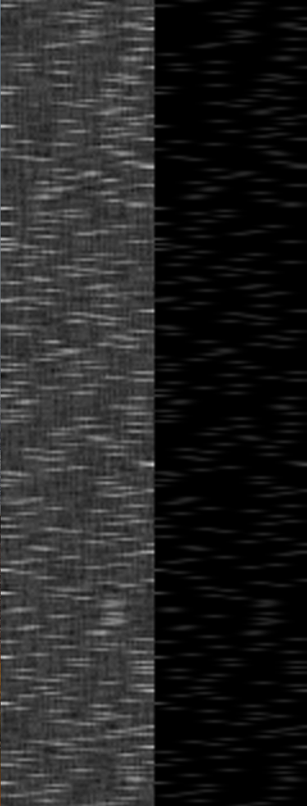

## Summary

Fully connect neural network implementation for steering angle proposal based on image input.
This was loosely adapted from [deep_learning](https://github.com/unccv/deep_learning) which I create
a Python neural network from scratch (using numpy as the primary dependency).

I was motivated to convert this to C++ because I have always wanted a reason to create a project
in C++. However most of the projects recently I have wanted to do required fast prototyping. This
was an awesome opportunity since the Python implementation had so few dependencies to use.

Neural Nets typically consist of stacked layers of neurons (the simply ones). There are many different
types of layer configurations such as convolutional, dropout, fully connected, etc. This repository only
contains a fully connected implementation. However using convolutional layers for image machine learning
would most likely have better performance. 

This repo contains:
 - Fully connected Layer
 - 2 Activation functions:
     - Sigmoid
     - Tanh
 - Adam optimizer back prop
 - QT visualization application
 
As you will find in the `NeuralNetRun.cpp` file, I used tanh activation on 2 layer inputs.
One of the challenges was replacing numpy. I solved this by using Opencv as the only
dependency, and leveraged its matrix manipulation functions and os file io operations. 

-----------------

## Contents

* [Installation](#Installation)
* [Running](#Running)
* [Project Structure](#Project-Structure)
* [Links](#links)

-----------------

## Installation

This repo requires only 2 dependencies (I am be felicitous, both of these are massive).
- Opencv 3.4.3
- QT 5.X (I used 5.12.1)

I wish I could give better info for both in terms of installing. However, there were
many steps for both (especially QT). I think in the next C++ repos, I will be using 
Python Jupyter / Tensorboard for all my visualizations, maybe even some kind of Python / C++ binding.

The best I can do is provide links for installing both, and other websites I found useful.
Just keep in mind that CMake needs to be able to execute `find_package(OpenCV REQUIRED)` and
`find_package(Qt5 COMPONENTS Core Widgets Concurrent Charts REQUIRED)`. 

[QT Installation](https://doc.qt.io/)
I did most of this code on a Mac, and tried using brew. I do not recommend it.
It would be better to just use the installer. Opencv was easier to install, but is still involved.

[OpenCV Installation for iOS](https://docs.opencv.org/3.4.3/d5/da3/tutorial_ios_install.html)

[OpenCV Installation](https://docs.opencv.org/3.4.3/df/d65/tutorial_table_of_content_introduction.html)

Once done pull the repo from github:
`git clone https://github.com/josiahls/FCNeuralNet`

`cd FCNeuralNet`

`cmake CMakeLists.txt` 
or as I found out using my Mac, I needed to specify the direct path to 
the correct cmake (default was 13.12.X), example path goes to the correct one:
`/Applications/CLion.app/Contents/bin/cmake/mac/bin/cmake -DCMAKE_BUILD_TYPE=Debug -G "CodeBlocks - Unix Makefiles" /Users/jlaivins/CLionProjects/FCNeuralNet`

`make`

Then Hurray! You installed it! This CMakeLists file also is fancy in that it will install
Google Test for you! Maybe in the future I can move the Opencv install to the cmake. 

As a note, I did not use windows because of the non-linux inputs and just generally not liking the operating system. 
If you have issues / trying to install on windows, I can try the best I can to help, but honestly Linux/iOS seems of 
more interest to me to support. Of course, if you get it to run on Windows, let me know the commands / issues / links 
you used and I can add them to this README.

## Running

A few things before you can run this. You need to follow the Data section at 
[deep_learning (the readme)](https://github.com/josiahls/deep_learning/tree/master/challenge).

The data folder should have the structure:
```bash
FCNeuralNet
├── data
│   └── training
│       ├── images
│       │   ├── 0000.jpg
│       │   ├── 0001.jpg
│       │   ├── ...
│       │   └── 1499.jpg
│       └── steering_angles.csv
```

Once you have data working, we can now determine if your installations work. You should be able to easily run:

For training the Neural Net:
`./FCNeuralNet -trainNN`
Feel free to go into `/src/executables/NeuralNetRun.cpp` and reference the `train` method. I think that the neural net
performance can be improved by changing the bin size (make larger), adding extra layers (more advanced features?),
and adding more neurons.

You might be interested in the output layer proposals. In the `train` and `run` method, there is commented out code 
which runs either is done, will show a window with the raw outputs (kind of cool) (but also kind of ugly...).
```c++
std::printf("\nShowing weight output comparison");
cv::Mat dst;
cv::normalize(nn.layers[0].w, dst, 0, 1, cv::NORM_MINMAX);
dst = dst.reshape(std::get<2>(imageDimension), std::get<0>(imageDimension));
cv::imshow("result",dst);
cv::waitKey(0);
```

Below is kind of what it looks like.

|   |
|:---:|
|   |
| |
| *Fig 1: The actual model outputs (Left) have noise due to weight outputs. They gradually become clearer the more epochs are run. The input values (Right) have a gaussian distribution applied to them (hence instead of a single steering angle value, its a range.)*  |

`./FCNeuralNet -runNN`
Also free to go into `/src/executables/NeuralNetRun.cpp` and reference the `run` method. However, this method
will produce all the final runs for the visualizer so I would not really want to change much.

`./FCNeuralNet -runVis` 
Directs to `/src/executables/VisualizationBoard.cpp` and you can reference the `run` method. However, unless you 
plan to make changes to maybe how the code initializes, I would recommend using a Python approach that I plan to go 
with. This visualization object selects the most recent `log` directory, and loads the most recent model from the 
`models` directory, so I would recommend you write a python script / notebook that reads directly from there. 
* Note, this will live read the graphs, but to load a model (get the nice video) you need to restart the visualizer.

Aaaand the end result should be something like this:


|   |
|:---:|
|   |
| |
| *Fig 2: These are the results based on the defaults found in the training code. I think I only wanted to wait for an hour. You can easily improve the results via more epochs, different batch sizes, more bins, and more layers.*  |


## Project Structure
```bash
.  # Should be FCNeuralNet
├── CMakeLists.txt
├── LICENSE
├── README.md
├── data      # Does not come with the git clone. Reference the Running section.
├── main.cpp  # Main Entry Points
├── src
│   ├── executables
│   │   ├── NeuralNetRun.cpp
│   │   ├── NeuralNetRun.h
│   │   ├── VisualizationBoard.cpp
│   │   └── VisualizationBoard.h
│   ├── layers
│   │   ├── Dimension.h
│   │   ├── Layer.cpp
│   │   └── Layer.h
│   ├── nn
│   │   ├── NeuralNet.cpp
│   │   └── NeuralNet.h
│   ├── ui
│   │   ├── ChartLogWidget.cpp
│   │   ├── ChartLogWidget.h
│   │   ├── ImageLogWidget.cpp
│   │   ├── ImageLogWidget.h
│   │   ├── LogFileReader.cpp
│   │   ├── LogFileReader.h
│   │   ├── LogImageFileReader.cpp
│   │   └── LogImageFileReader.h
│   └── utils
│       ├── BoardWriter.cpp
│       ├── BoardWriter.h
│       ├── DatasetCar.cpp
│       ├── DatasetCar.h
│       ├── DebugHelpers.cpp
│       ├── DebugHelpers.h
│       ├── Logger.cpp
│       └── Logger.h
└── test
    ├── BoardWriterTest.cpp
    ├── CMakeLists.txt
    ├── DatasetTest.cpp
    ├── LayerTest.cpp
    ├── Matrix2dTest.cpp
    ├── NeuralNetTest.cpp
    └── OpenCVUnitTest.cpp
```

## Contribution guidelines
I am most likely going to start a new repo building on this. There are a lot of things I plan to change such as:
- Move NeuralNetRun methods into their own objects / make part of the NeuralNet object
- Drop QT and use Python Jupyter or a Tensorboard log file maker (which means I could keep the project 100% C++)
- Add Dropout Layers
- Add bias (probably the first thing I would add besides better logging)
- Add Convolutional Layers
- Add ReLu and LeakyReLu activation functions to experiment with.
- Remove "FCNeuralNet" constants from the writers and dataset objects. Use CMake to insert them as Macros
    - Initially tried doing this, but did not want to spend a whole day working on something that really did not seem 
    like as big of an issue and the 1000 other things I needed to work in.
- Add more datasets
    - I want to add MNIST and FashionMNIST
    
Feel free to do PRs / Forks of this repo. Let me know if there are any changes. If they are big,
I might go ahead and jump start a new repo. For questions the issues tracker is always good.

## License

[MIT License](LICENSE)
